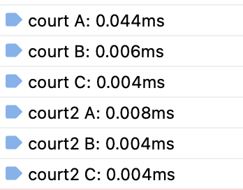

#  Kagi Developer Assessment

## Overview

This is John Paul Davis's submission for the [Kagi Developer Assesment](https://gist.github.com/jacobwinters/6d0cabf12f12c0372639aecf00867482). It delivers both parts of the assesment with an [Express](https://expressjs.com) server set up so it can be run locally.

You can view a deployed version of this on Netlify [here](https://kagidevassesment.netlify.app).

## Dependencies

This requires that [Node.js](https://nodejs.org/en) be installed and able to run on your computer.

## To set up

Having cloned or downloaded the repo, run `nvm use` then `npm install`.

Once the packages are installed, you can run `npm run start` to start Express.

## Task 1 - HTML Recipes

This will appear at [http://localhost:3000](http://localhost:3000) when the Express server is intitialized.

## Task 2 - JavaScript optimization

The Javascript challenge is being executed in the same file served [http://localhost:3000](http://localhost:3000) when the Express server is intitialized. 

In `public/js/app.js` you will find an ES Class that contains all the Javascript. There are two main functions I tested - `court` and `court2`. I knew early on that I wanted use a reducer to allow me to make calculations without storing any data. 

But I also wondered if it would be worth it to exit out of the function early if the number of judges was greater than or equal to the number of defendants (because we know the time to the end will be 30 minutes in that scenario). So I tried that first (see: `court`), and then tried just not testing for that at all (see: `court2`), and it turns out that exiting the data "stream" in the `chain` reducer is not worth it - performace takes a big hit, sometimes doubling the time to execute, and sometimes increasing it by 5 or 10. In the screenshot below, the `A` test is measuring the scenario where there are more judges - you can see it takes, in this round, 5.5 times as long to interrupt the reducer and test for the number of judges. This is even true if one doubles or triples the number of names - `court2` consistenly outperforms `court1`.

The script is logging both the output of both versions under 3 scenarios in the console, and logging the performance test results underneath. Refreshing the page in the browser will refresh the results as well. I opted to test in the browser rather than in Node, because when I'm working as a front-end developer, I usually expect my code to be executed in a browser.

